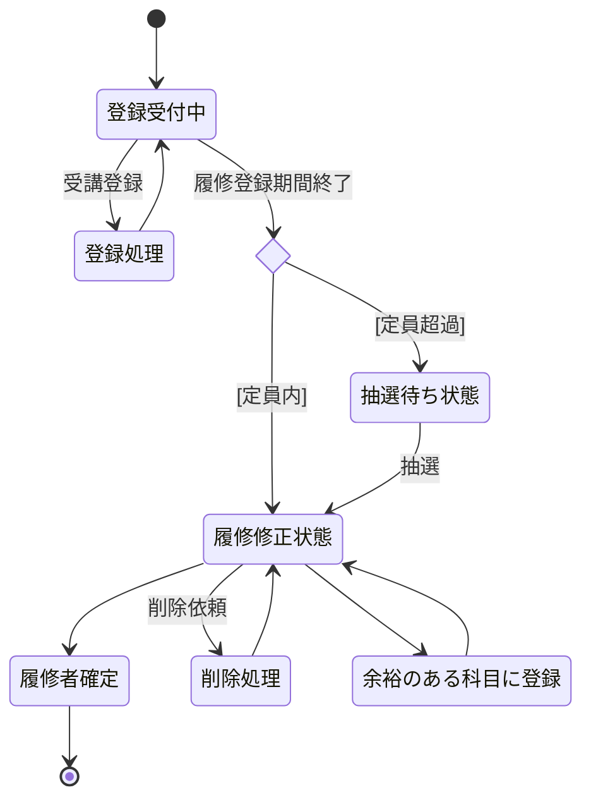

# 演習1

```mermaid
stateDiagram-v2
direction TB
s1 : 登録受付中
r1 : 登録処理
s2 : 抽選待ち状態
se : 履修者確定
se2 :履修修正状態
se3 : 削除処理
se4 : 余裕のある科目に登録
state sc <<choice>>

[*] --> s1
s1 --> r1 : 受講登録
r1 --> s1
s1 --> sc : 履修登録期間終了
sc --> s2 : [定員超過]
sc --> se2 : [定員内]

s2 --> se2 : 抽選
se2 --> se 

se2 --> se3 : 削除依頼
se3 --> se2
se2 --> se4
se4 -->se2
se --> [*]


```
